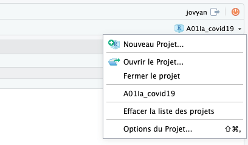
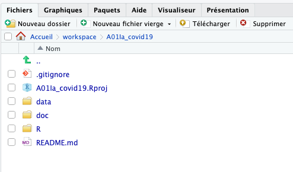
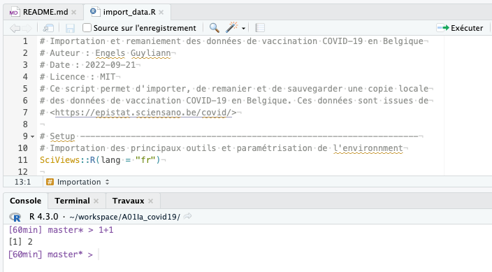
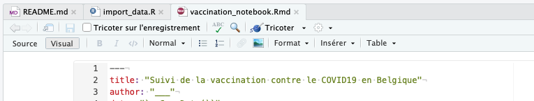
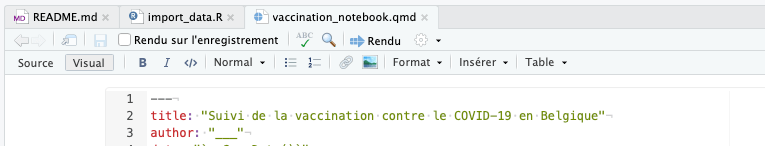
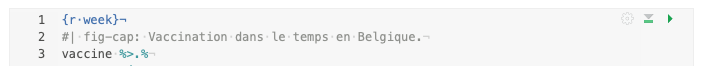
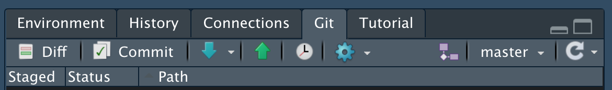

# Suivi de la vaccination contre le COVID-19 en Belgique

## Avant-propos

Ce projet nécessite d'avoir assimilé l'ensemble des notions du premier module du cours de science des données biologiques I. Dans le module 1, vous avez été renvoyé vers des appendices comme l'[appendice B](https://wp.sciviews.org/sdd-umons/?iframe=wp.sciviews.org/sdd-umons-2023/prise.html). Ce projet nécessite également d'avoir pris connaissance de ces appendices. Il correspond au dépôt GitHub <https://github.com/BioDataScience-Course/A01Ia_covid19>.

## Objectifs

Ce projet est *individuel*, *cadré* et à durée limitée (2h). Il vous permet de :

-   cloner un projet hébergé sur GitHub
-   découvrir l'organisation des dossiers d'un projet scientifique
-   découvrir le R Markdown
-   réaliser des modifications, des "commits", des "pulls" et des "pushes" pour synchroniser vos modifications avec le dépôt GitHub.

## Consignes

Ce projet vise à vous familiariser avec les bases de l'utilisation de RStudio pour analyser des données. Suivez les explications ci-dessous, repérez les différents éléments dans votre logiciel et effectuez les exercices demandés à l'intérieur des différents fichiers...

Il est également utile de vous familiariser avec les **aide-mémoires** suivants en parallèle (ils contiennent une foule d'information, mais essayer dans un premier temps d'y retrouver déjà ce que vous apprenez ici) :

-   **RStudio IDE** (voir aussi <https://rstudio.github.io/cheatsheets/html/rstudio-ide.html>)

-   **Publish and Share with Quarto** (voir aussi <https://rstudio.github.io/cheatsheets/html/quarto.html>)

-   **rmarkdown** (voir aussi <https://rstudio.github.io/cheatsheets/html/rmarkdown.html>)

### Projet dans RStudio

Vous gérez les projets dans RStudio via un menu déroulant en haut à droite de la fenêtre. Ce menu est représenté par une petite boite bleue avec un "R" dedans (en dessous du nom d'utilisateur qui est toujours "jovyan" dans une machine Saturn Cloud et du bouton d'arrêt de session orange tout en haut à droite). Ce bouton donne accès à un menu déroulant qui permet de créer un nouveau projet, ouvrir un projet existant ou naviguer rapidement entre les derniers projets qui ont été ouverts.



Normalement, vous l'avez déjà utilisé pour créer ce projet. Voyez maintenant ce que cela donne de refermer le projet via le menu déroulant, et ensuite de le rouvrir. **Vérifiez toujours que RStudio est dans le bon projet en allant lire son nom en haut à droite de la fenêtre avant de travailler**. En effet, il peut arriver que, par distraction, on ouvre un fichier qui n'appartiennent pas au projet. On peut le faire, mais RStudio restera focalisé sur le projet ouvert (ou sur aucun éventuellement). Vous ne pourrez alors, par exemple, pas effectuer de commit, pull et push de vos modifications (voir plus loin).

### Structure du projet : dossiers et fichiers

La structuration d'un projet dans GitHub en science des données respecte quelques conventions que vous devez appliquer. Des explications sur l'organisation d'un projet sont disponibles dans l'appendice [B.1.1.2 Organisation d'un projet](https://wp.sciviews.org/sdd-umons/?iframe=wp.sciviews.org/sdd-umons-2023/rs.html).

Dans RStudio, vous visualisez le contenu d'un projet et vous naviguez dans ses sous-dossiers à partir de l'onglet **Fichiers** qui se trouve dans le panneau en bas à droite de la fenêtre.



On y retrouve généralement :

-   un fichier `README.md` qui présente le contenu du dépôt (que vous lisez en ce moment)
-   dans le cas de RStudio, un fichier `.Rproj`, ici `A01Ia_covid19.Rproj` qui ouvre et paramètre le projet dans RStudio. Vous ne l'éditez jamais directement.
-   un fichier `.gitignore` pour un dépôt git qui indique les fichiers qui ne doivent pas être repris dans les versions (fichiers temporaires, versions finales des rapports, par exemple). **Vous ne devez pas y toucher.**
-   un dossier `data/` qui comprend les données comme par exemple, des fichiers au format CSV
-   un dossier `doc/` qui contient les bloc-notes, les rapports ou les présentations liés au projet
-   un dossier `R/` qui rassemble des fichiers composés d'une suite d'instructions qui peuvent être interprétés pour effectuer des analyses, dont l'extension est `.R`. Ce sont les "scripts R" que vous allez découvrir tout au long du cours. Des explications complémentaires se trouvent dans l'appendice [B.1.2 Scripts R dans RStudio](https://wp.sciviews.org/sdd-umons/?iframe=wp.sciviews.org/sdd-umons-2023/rs.html).

Explorez chaque dossier et ouvrez les fichiers se trouvant dans les dossiers `R/` et `doc/` en cliquant dessus. Vous allez maintenant réaliser les exercices qui s'y trouvent.

### Fichier R/import_data.R

Ouvrez le fichier `R/import_data.R`. Il s'ouvre dans la **zone d'édition** qui se trouve dans le panneau en haut à gauche de la fenêtre. Vous n'allez rien modifier dans ce fichier, mais vous allez exécuter les différentes instructions qui s'y trouvent afin d'obtenir les données les plus récentes de vaccination depuis l'Internet et de préparer un nouveau tableau de données propre.



Pour cela, vous placez le curseur sur la ligne à exécuter (vous commencez au début du document) sans rien sélectionner. Ensuite, vous appuyez sur le bouton **Exécuter** dans la barre d'outil de la zone d'édition (ou utilisez le raccourci clavier `CTRL + Entrée` sous Windows ou `CMD + Entrée` sous MacOS). Vous voyez une ou plusieurs lignes qui sont recopiées dans la **Console** (dans le panneau en bas à gauche), et ensuite du texte apparaît relatif au résultat de l'exécution de l'instruction. Ces instructions sont exécutées dans le logiciel R et c'est donc l'onglet **Console** qui vous donne accès au moteur de calcul de R.

Tout ce qui suit un dièse `#` est du commentaire qui n'est pas interprétés par R. Vous l'utiliserez pour documenter vos instructions (c'est important de le faire !)

Vous pouvez aussi entrer directement des instructions dans la **Console**. Essayez, par exemple `1 + 1` et tapez ensuite sur la touche `Entrée`, encore appelée `Retour chariot` à la droite de votre clavier, représentée par une flèche qui pointe vers le bas puis vers la gauche. R effectue le calcul et répond `[1] 2`. Le résultat est bien "2". Le "[1]" entre crochet indique que c'est le premier (et seul) élément d'un vecteur. Si votre instruction génère plusieurs nombres, c'est pratique. Essayez par exemple `1:100 \* 2` pour comprendre l'intérêt de ces indices entre crochets devant la réponse (cette fois-ci, un vecteur de cent nombres est renvoyé).

Lorsque vous aurez exécuté toutes les instructions de `import_data.R` vous aurez mis à jour le fichier `data/be_vaccine_covid.rds` qui contient les données et vous pourrez passer à l'étape suivante.

### Fichier R Markdown/Quarto

Ouvrez le fichier `vaccination_notebook.Rmd`, il s'agit d'un carnet de notes concernant l'évolution de la vaccination en Belgique. Comme vous connaissez maintenant la structure classique d'un projet, vous savez où ce fichier se trouve.

Cliquez sur le bouton **Tricoter** (ou **Knit** dans une version anglaise de RStudio). Ce bouton se trouve dans la barre d'outils au-dessus du document que vous venez d'ouvrir. Ce fichier est au format "Rmd" qui signifie qu'il s'agit d'un document **R Markdown**. 

Il existe un format similaire "Qmd", dit **Quarto** très semblable, mais plus récent. Nous utiliserons tantôt l'un, tantôt l'autre. La barre d'outils est légèrement différente et le bouton qui compile la version finale s'appelle ici **Rendu** avec une icône en forme de flèche bleue pointant vers la droite.



Pour cette première activité, retenez qu'il s'agit de formats qui permettent de combiner le langage Markdown (que vous avez découvert dans ce premier module) et le langage R (que vous allez découvrir lors du second module). R permet, entre autres, la manipulation, la visualisation et l'application de calculs statistiques sur des données. Vous en avez eu un court aperçu juste avant avec le script R `import_data.R`.

Ouvrez le fichier et suivez les directives qui s'y trouvent. En particulier, Assurez-vous d'avoir bien repéré les trois zones distinctes d'un document :

-   un préambule, encore appelé **entête YAML** (du nom du langage utilisé pour y encoder des informations)
-   les **zones de texte** mises en forme à l'aide du Markdown
-   les **zones de code** R, encore appelées **chunks**

Le préambule débute *toujours* par `---` et se termine *toujours* par `---`. On y indique des informations sous la forme `clé: valeur`. Il ne faut pas d'espace entre la clé et les deux points, par contre il faut un espace entre les deux points et la valeur qui peut être indiquée entre doubles guillemets s'il s'agit de texte.

Les zones de texte respectent les conventions du langage Markdown.

-   En mode éditeur visuel (bouton **Visual** enfoncé), les balises de formatage du texte sont cachée et vous avez un rendu type (titres en police plus grande, gras, italique, images insérées, ...), mais pas encore un rendu final qui dépendra du format choisi et d'autres paramètres indiqués éventuellement dans le préambule.

-   En mode éditeur source (bouton **Source** enfoncé), les balises de formatage Markdown du texte sont clairement visibles. Les lignes sont numérotées dans la marge à gauche. C'est pratique pour retrouver un endroit dans le document en cas d'erreur qui renseigne un numéro de ligne. Laissez toujours une ligne vide entre les différents éléments du texte, comme un titre, un paragraphe, un chunk, ainsi qu'après les `---` de la fin d'entête YAML lorsque vous travaillez dans ce mode.

Les zones dédiées au code sont balisées par ```` ```{r} ```` pour des chunks faisant appel au logiciel R, et sont terminées par trois apostrophes inverses (```` ``` ````) lorsqu'elles sont visualisées en mode éditeur source. Dans tous les cas, les chunks apparaissent sur un fond de couleur différente (par exemple, grisé si le fond est blanc avec le thème choisi) et une série de boutons verts apparaissent en haut à droite du chunk pour contrôler l'exécution des instructions qu'il contient.



Des commentaires sont mis à votre disposition dans le texte. Vous verrez qu'il y a des commentaires distincts pour les consignes qui vous expliquent ce que vous devez faire. Les deux types (commentaire normaux et consignes) ne seront *pas* affichés dans le document final. **Vous ne devez pas y toucher.**

Suivez maintenant les consignes du document. Générez les tableaux et graphiques et complétez le document là où c'est demandé. Ensuite, compilez la version finale de votre bloc-notes (bouton **Tricoter** ou **Rendu**).

Il est possible de changer le format de sortie (HTML, PDF, Word), mais pour l'instant, contentez-vous du format HTML qui est le plus flexible. Retrouvez toutes les informations sur le R Markdown dans l'annexe [B.1.3 R Markdown/R Notebook](https://wp.sciviews.org/sdd-umons/?iframe=wp.sciviews.org/sdd-umons-2023/rs.html).

Vous avez bien travaillé ! Il est temps de réaliser une sauvegarde de votre projet et de mettre à jour la version sur GitHub.

### Commit et synchronisation des modifications avec GitHub

Avant toute chose, assurez vous **toujours d'avoir enregistré tous vos documents**. Dans la zone d'édition, observez bien les différents onglets ouverts. Ils portent le nom des fichiers. Si ce nom est en rouge et suivi d'un astérisque, alors il y a des modifications non sauvegardées. Cliquez sur l'onglet et ensuite allez dans le menu **Fichier** -\> **Enregistrer**. Repérez l'icône au début de cette entrée de menu. C'est une petite "disquette" bleue. C'est le support qui était utilisé au 20ème siècle pour enregistrer des documents informatiques, mais qui a disparu aujourd'hui. L'icône est restée, par contre, pour symboliser l'enregistrement d'un document ! Vous repérez ensuite la même icône dans la barre d'outils. C'est un raccourci utile pour enregistrer, de même que le raccourci `CTRL + S` (enfoncez la touche `CTRL`, puis `S` et enfin relâchez les deux pour activer ce **raccourci clavier**. Il est aussi renseigné à la droite de l'élément de menu (vous devez rouvrir le menu **Fichier** pour le voir). Sur le Mac, ce sera plutôt le raccourci `CMD + S`. Vous avez aussi une entrée de menu **Sauvegarder tout** qui est bien pratique si plusieurs documents sont en cours d'édition. Repérez aussi l'icône et le raccourci clavier correspondants.

Une fois tous vos fichiers sauvegardés, vous allez réaliser successivement un "commit", un "pull" et un "push" pour créer un point d'enregistrement de version (le "commit") et pour synchroniser vos changements avec le dépôt GitHub (le "pull" et le "push").



Pour cela, vous aller ouvrir l'onglet **Git** qui se trouve dans le panneau supérieur droit dans votre fenêtre. Cliquez ensuite sur le bouton **Commit** dans sa barre d'outils. Une fenêtre s'ouvre qui vous rappelle les modifications réalisées dans chaque fichier du projet. Sélectionnez les fichiers que vous souhaitez reprendre dans votre commit (mettez une coche dans la case devant le nom du fichier ; la plupart du temps, on sélectionne tout). Vous devez ajouter un **message informatif** à ce commit dans la partie de droite. Le message doit présenter de manière claire et concise ce que vous avez réalisé. Par exemple : "Ajout de l'auteur et des commentaires des tables et figures." Cliquez enfin sur le bouton **Commit**.

Vous venez de réaliser votre premier commit ! Ne fermez pas encore la fenêtre. Cliquez maintenant sur la flèche bleue afin de faire un "pull" puis cliquez sur la flèche verte afin de faire un "push". Lisez bien les messages qui apparaissent. C'est là que les problèmes éventuels seront exposés, mais ici, il ne devrait pas y en avoir. Vous pouvez fermer la fenêtre de commit à présent.

Rendez-vous maintenant sur GitHub afin de vérifier que vos modifications et votre commit sont bien répercutés dans le dépôt en ligne. Pour y accéder, retrouvez votre projet dans l'organisation GitHub <https://github.com/BioDataScience-Course> et ensuite, lisez ce qui apparaît en haut de la page : le texte de votre commit doit s'y trouver. Et si vous naviguez vers les fichiers qui ont été édités et que vous affichez leur contenu, vous devez y retrouver vos modifications.

**Il est très important d'effectuer cette dernière vérification !** Chaque année, des étudiants perdent des points parce qu'il ont oublié de faire un dernier commit et/ou un push. Par conséquent, la fin de leur travail n'apparaît pas dans GitHub. Or la seule version que vos enseignants voient est celle sur GitHub. Votre travail local dans votre machine Saturn Cloud ne leur est pas accessible !

Une fois tout cela effectué, vous avez terminé et devriez être plus à l'aise dans l'utilisation de base de RStudio pour éditer des documents et les compiler en forme finale, ainsi que dans l'utilisation principale de git et GitHub via le clonage de projet, les commits, pulls et pushes.

### Vérifications

TODO: testthat...

*Une fois terminé, vous pouvez clôturer la session en cliquant sur le bouton orange tout en haut à droite de la fenêtre. Cela va refermer proprement votre machine Saturn Cloud (prenez l'habitude de le faire toujours en fin de session).*
