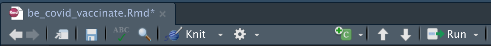
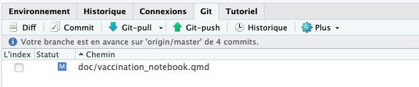

# Suivi de la vaccination contre le COVID19 en Belgique

## Avant-propos

Les consignes reprises dans ce document, ainsi que dans les différents fichiers sont susceptibles d'évoluer. N'hésitez pas à vérifier le lien suivant afin de voir si des modifications n'y ont pas été apportées : <https://github.com/BioDataScience-Course/A01Ia_21M_covid19> .

Ce projet nécessite d'avoir assimilé l'ensemble des notions du premier module du cours de Science des données biologiques 1.

## Objectifs

Ce projet est *individuel*, *cadré* et à durée limitée (2h). Ce projet vous permet de :

-   cloner un projet hébergé sur GitHub
-   découvrir l'organisation des dossiers d'un projet scientifique
-   Découvrir le Rmarkdown
-   Réaliser des modifications, des commits et des push.

## Consignes

La structuration d'un projet en science des données respecte quelques conventions que vous devez appliquer. On y retrouve généralement :

-   un fichier `README.md` qui présente le projet
-   un dossier `data/` qui comprend les données comme des fichiers au format `csv`
-   un dossier `docs/` qui comprend les rapports, les présentations liés au projet
-   un dossier R comprend des scripts R avec l'extension .R. Ces scripts contiennent du code R que vous allez découvrir tout au long de cours.

Explorez chaque dossier et ouvrez les fichiers se trouvant dans le dossier `R/` et dans le dossier `docs/`. Lisez les nombreux commentaires et le code qui s'y trouve.

Ouvrez le fichier `be_covid_vaccinate.Rmd`, il s'agit d'un rapport concernant l'évolution de la vaccination en Belgique. En connaissant la structure classique d'un projet, vous savez où ce fichier se trouve.

Sélectionnez le bouton `Knit` qui se trouve dans la barre d'outils au-dessus du document que vous venez d'ouvrir. Ce fichier est un au format Rmd qui signifie qu'il s'agit d'un document rmarkdown. Pour cette première activité, retenez qu'il s'agit d'un format qui permet de combiner le markdown (que vous avez découvert dans ce premier module) et le langage R (que vous allez découvrir lors du second module.). Le langage R permet entre autres la manipulation, la visualisation et l'application de calculs statistiques sur des données.



Vous venez de réaliser votre première compilation d'un document au format Rmd vers un document au format html. Il est possible en appuyant sur le menu déroulant à côté du bouton Knit, de définir si vous voulez un document compilé au format HTML, PDF ou Word. Retrouvez toutes les informations sur le rmarkdown dans l'annexe [B.1.3 R Markdown/R Notebook](https://wp.sciviews.org/sdd-umons/?iframe=wp.sciviews.org/sdd-umons-2022/rs.html).

Repérez les trois zones spécifiques d'un document rmarkdown

-   un préambule, encore appelé entête YAML (du nom du langage utilisé pour y encoder des informations)
-   les zones d'édition éditées avec le langage markdown
-   des zones de code R appelées des chunks

Le préambule débute **toujours** par --- et se termine **toujours** par ---. Il n'y a pas de ligne vide dans un préambule. On y indique des if `nom: valeur`. Il ne faut pas d'espace entre le nom et les deux points, par contre il faut un espace entre les deux points et la valeur.

Les zones d'édition en markdown respectent les conventions markdown. Laissez toujours une ligne vide entre un paragraphe et un chunks ainsi qu'après les --- de la fin du préambule.

Les zones dédiées au code sont balisées p```` ```{r} ```` pour des chunks faisant appel au logiciel **R**, et sont terminés par trois apostrophes inverses (```` ``` ````).

Des commentaires sont mis à votre disposition dans les zones d'édition en markdown. Vous avez appris la syntaxe afin de rédiger un commentaire dans un document. Nous utilisons les commentaires afin de vous transmettre les consignes des travaux cadrés. Ces consignes sont des compléments au README.

Éditez à présent le premier chunk de ce document. Retirer le dièse présente devant l'instruction `source(here::here("R", "import_data.R"))`. Enregistrez votre document en sélectionnant la petite disquette proposée dans la barre d'outils. Compilez à nouveau votre document en sélectionnant le bouton `knit`. Analysez votre document compilé afin d'observer les différences obtenues.

Replacez le dièse devant l'instruction `source(here::here("R", "import_data.R"))` et sauvegardez votre document.

Complétez la section `Éléments clés` en suivant les instructions dans les balises liées aux consignes.

Réalisez un `commit` et un `push`. Sélectionnez l'onglet Git à côté des onglets `Environment`, `History` ou encore `Connections`.



Sélectionnez ensuite l'onglet `Commit` qui ouvre une fenêtre vous montrant vos modifications réalisées dans chaque fichier du projet. Sélectionnez les fichiers que vous souhaitez sauvegarder via ce commit. Vous devez ajouter un message **informatif** à ce commit. Le message doit présenter de manière claire et concise ce que vous avez réalisé.

Réalisez un `push`. Rendez-vous sur GitHub afin de vérifier que vous avez réalisé correctement votre commit et votre push. Pour y accéder, retrouvez votre projet dans l'organisation GitHub <https://github.com/BioDataScience-Course> ou bien vous allez utilisez la console R et y introduire l'instruction suivante `usethis::browse_github()`. Cette instruction est très pratique et vous ouvre une page web avec votre projet.
